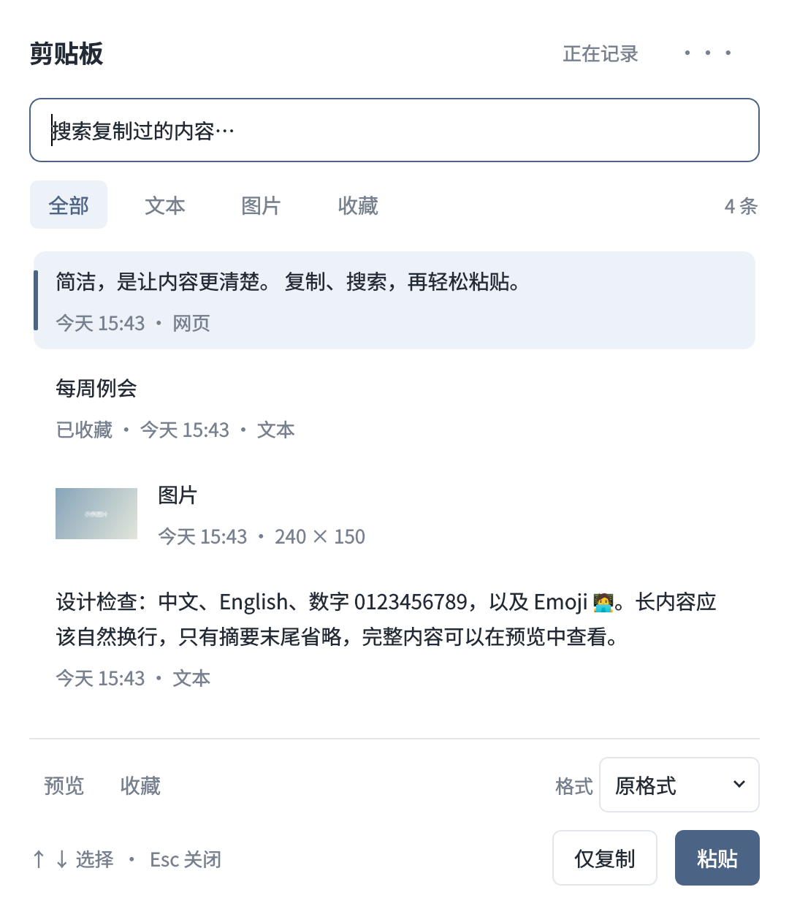

# Simple Clipboard · 剪贴板

本地桌面剪贴板管理器 · 当前分支 0.3.0 工程预览 · GPL-3.0

简洁的本地剪贴板工具，支持文字、HTML 和静态图片。已验证 Ubuntu 22.04 / GNOME / X11；第三阶段加入 Windows 11、macOS 14 起的适配，Mac 提供 Intel 与 Apple Silicon 两种包。完整支持声明以验收报告为准。



## 安装与启动

在 Ubuntu 22.04 安装系统依赖后运行（需要 X11 桌面会话）：

```bash
sudo apt install python3-pyqt5 python3-gi libx11-6 libxtst6
git clone --branch phase-3-platforms https://github.com/asoming/simple-clipboard.git
cd simple-clipboard
bash start.sh
```

默认 **Ctrl+Alt+V** 打开或关闭面板，Mac 默认 **Cmd+Shift+V**。重复启动会打开已运行的窗口。

预览包位于 [GitHub Actions](https://github.com/asoming/simple-clipboard/actions) 成功运行的 Artifacts 中（保留 14 天，需要 GitHub 登录）。Windows 下载 `windows-x64-preview` 的 setup.exe；Mac 选择 `macos-arm64-preview` 或 `macos-intel-preview` 的 dmg，将应用拖入 Applications 后再启动。Ubuntu 下载 deb，用 `sudo apt install ./simple-clipboard_0.3.0-preview1_all.deb` 安装。

**这是工程预览，未签署 Windows 发行证书或完成 Apple Developer ID 公证。** SmartScreen / Gatekeeper 首次下载体验尚未验收；不提供关闭系统安全检查的脚本。正式签名发行与日常应用实机验收仍是第三阶段出口条件。

Windows/macOS 对应源码可从同次构建的 `sources` 获取，依赖版本与许可证见 [第三方说明](packaging/THIRD-PARTY.md)。

启动脚本使用 `/usr/bin/python3` 和系统 PyQt5。`requirements.txt` 供开发参考；仅在虚拟环境安装依赖不会改变启动脚本使用的解释器。

0.3.0 沿用 0.2.0 数据库格式。打开 0.1.x 数据时通过事务升级，失败回滚、不自动重建。新版数据库不能用 0.1.x 打开。

## 日常操作

1. 在其他应用中复制文字、网页选中内容或图片。
2. 按全局快捷键，搜索关键词或切换「全部 / 文本 / 图片 / 收藏」。
3. 用 **↑ / ↓** 选择，按 **Enter** 粘贴。

| 操作 | 方法 |
|---|---|
| 原格式 / 纯文本 | 底部「粘贴格式」，同时影响「仅复制」和「粘贴」 |
| 仅复制 | Ctrl+Enter，或底部「仅复制」 |
| 关闭面板 | Esc；不改变剪贴板 |
| 收藏 / 取消收藏 | Ctrl+D，或底部按钮 |
| 完整文本、图片预览 | Ctrl+Space，或「预览」；图片支持原始尺寸滚动查看 |
| 修改收藏名称、删除 | 右键记录；Ctrl+Delete 删除当前记录 |
| 暂停、忽略下一次复制 | 右上角「···」 |
| 快捷键、外观、自启动、保存规则 | 「··· → 设置」 |
| 存储与隐私说明、清空历史、退出 | 「···」菜单 |

Mac 的面板内 Ctrl 快捷键对应 Cmd，例如 Cmd+Enter 仅复制。

### 格式范围

- **原格式：**保存文字及来源提供的 HTML，或静态图片；不承诺保留 RTF、办公应用专有对象和网页全部排版。HTML 以纯文本预览，避免加载外部网页资源。
- **纯文本：**仅提供原有文字，去掉来源 HTML；目标编辑器仍可沿用光标处的样式。每次重新打开面板默认「原格式」。
- **图片：**转为 PNG 保存，生成小缩略图；保留像素和颜色配置，归一化作者、DPI 等元数据。不做 OCR，不搜索图片中的文字；可收藏命名后按名称搜索。
- 图片最多 2400 万像素、任一边不超过 16000 像素，并受单条字节上限约束。动画和文件复制不在支持范围内。

### 终端

Linux 已识别终端使用 Ctrl+Shift+V；Windows 使用 Ctrl+V，Mac 使用 Cmd+V。应用不发送 Enter。Windows Console 若禁用 Ctrl 快捷键，需手动粘贴。

多行文本只复制并提示手动粘贴，因为文本中的换行也可能执行命令。图片不会自动粘贴到已识别的终端。编辑器内嵌终端和网页终端不能仅凭外层窗口可靠识别，请使用「仅复制」。

自动粘贴依赖目标应用支持对应格式和快捷键。无法确认原窗口焦点时，显示手动粘贴提示；发送快捷键不等于目标应用已接收内容。

## 保存与设置

- 新安装使用当前用户的数据目录，见下表；旧源码目录已存在 `data/history.sqlite3` 时继续原地使用，不自动搬移。新建 POSIX 目录权限为 700，文件为 600；Windows 使用用户目录的继承 ACL，不把 chmod 当作 Windows 访问控制。
- 普通历史默认保留 **7 天、最多 500 条**；收藏不自动删除。
- 默认总内容容量 **100 MiB**，单条上限 **10 MiB**；设置可调整。容量包含文字、HTML、PNG 和缩略图，数据库索引额外占用空间，界面同时显示文件实际大小。
- 保存新规则会立即清理超限普通历史；不能把总容量降到收藏占用以下。降低单条上限只限制后续复制。
- 外观默认跟随系统，也可选择浅色或深色。
- **登录自启动默认关闭**。Linux 使用用户 autostart desktop 文件，Windows 使用当前用户 Run 注册表项，Mac 使用用户 LaunchAgents plist。Mac 写入后在下次登录生效。移动应用后需重新设置。真实注销/重登仍待验收。
- 自启动目录不可写时，界面会明确提示失败；保存规则和外观仍会生效。若运行环境限制系统目录写入，请在有权限的桌面会话中运行后设置。

### 数据目录、升级与卸载

| 平台 | 默认历史目录 |
|---|---|
| Windows | `%LOCALAPPDATA%\SimpleClipboard` |
| macOS | `~/Library/Application Support/SimpleClipboard` |
| Linux | `$XDG_DATA_HOME/simple-clipboard`，默认 `~/.local/share/simple-clipboard` |

「保存与隐私」显示实际路径。可用 `--data-dir` 指定目录；同一目录只允许一个实例。

- **同目录更新：**先退出应用，覆盖安装新版。安装目录与历史分离，卸载默认保留历史。
- **从旧版源码迁入安装版：**退出旧版，在安装版空历史中选择「··· → 从旧版导入」，选旧版 `data/history.sqlite3`，确认后重启导入。新目录已有历史时拒绝覆盖，不做自动合并。
- 导入在临时副本上做完整性、版本与事务升级检查，成功后原子替换空历史。失败保留源文件和当前历史；设置一起导入，过期普通记录按保存规则清理。
- **主动删除：**「清空历史」勾选删除收藏，可再选择重置设置并退出，同时关闭自启动。是否清空当前系统剪贴板单独选择。之后可卸载并手动删除上表目录；清理不宣称是介质安全擦除。
- Mac 卸载前关闭自启动，避免保留指向已删除应用的 LaunchAgent。Windows 卸载器会删除本应用的 Run 项。

高级导入方式：`SimpleClipboard --data-dir <空目录> --import-history <旧版数据库>`；源码运行时将程序名替换为 `python run_app.py`。

### 系统差异

- Mac 自动粘贴使用辅助功能权限；未授权时继续保存、搜索与仅复制，菜单可打开对应系统设置。应用不自动申请屏幕录制或输入监控权限。
- Mac 每 150 毫秒检查剪贴板变化计数，解决 Qt 5 在后台不及时通知的问题；两次检查之间被连续覆盖的中间内容可能错过。
- Mac 激活应用后还核对原窗口；同一应用的窗口切换无法恢复时提示手动粘贴。
- Windows 遵守前台切换和 UIPI 限制。普通权限不能自动输入到管理员应用，不通过提权或绕过系统限制来处理。

## 隐私边界

不上传、不登录、不记录正文或搜索词日志。本地历史未加密，不承诺自动识别所有密码。尊重受支持的敏感 MIME 标记，但来源应用可能不提供标记；复制敏感内容前可以暂停或忽略下一次复制。

首次启动不采集已有剪贴板；暂停后不采集，恢复时不补录，暂停状态跨重启保留。暂停或清空会取消未完成的记录任务。

删除历史不等于清空系统剪贴板。清空对话框默认保留收藏，并提供独立的「同时清空系统当前剪贴板」选项。普通删除不宣称是安全擦除。

应用排除名单尚未实现：还没有完成可靠的来源识别验证，不能把当前前台应用当作剪贴板来源。

**分享时请排除所有数据目录。** 打包脚本只收集源码和明确列出的依赖，不收集运行历史。

## 验收状态

详见 [第三阶段验收报告](docs/第三阶段验收报告.md)、[第二阶段验收报告](docs/第二阶段验收报告.md) 和 [PRD](docs/剪贴板应用-PRD.md)。

已测 Chrome、Edge 的文字、HTML、纯文本和 PNG 往返，GNOME Terminal 单行粘贴及多行保护、当前 IBus 真实拼音输入，以及独立 Qt 编辑器。微信文字复制和中文搜索修复已获用户确认；微信图片粘贴、日常截图流程仍待用户试用。

Windows/macOS 已加入原生接口与构建测试；Windows 11 实机、Mac Intel 的 macOS 14 基线、常用应用中文输入法、权限首次授权、睡眠恢复和真实登录自启动仍需验收。GitHub Windows Server runner 不能替代 Windows 11 用户桌面。Wayland 尚不支持。

开发过程和验收规则见 [AGENTS.md](AGENTS.md)。

## 测试

数据测试不接触桌面：

```bash
cd simple-clipboard
QT_QPA_PLATFORM=offscreen PYTHONPATH=. /usr/bin/python3 -m unittest discover -s tests -p test_store.py -v
QT_QPA_PLATFORM=offscreen PYTHONPATH=. /usr/bin/python3 -m unittest discover -s tests -p test_phase2.py -v
```

GitHub Actions 使用 Ubuntu 22.04 + Xvfb、Windows Server 2025 x64、macOS 14 arm64、macOS 15 Intel。Windows/macOS 原生按键与剪贴板测试仅在托管临时 runner 上启用，不连接用户桌面；系统特有测试在其他平台明确跳过。

本机全套测试必须在独立 X11 服务器上运行。**不要把隔离开关用于日常桌面。** 不同桌面测试不要共用一个显示服务器同时运行。自动测试隔离实际输入法；真实中文输入法另行在空白窗口验证。

```bash
# 在单独终端启动，若编号占用则选择其他编号：
Xephyr :100 -ac -screen 1100x850 -noreset -nolisten tcp

# 另一个终端运行：
DISPLAY=:100 QT_IM_MODULE=compose CLIPBOARD_ISOLATED_TEST=1 QT_QPA_PLATFORM=xcb PYTHONPATH=. \
  /usr/bin/python3 -m unittest discover -s tests -v
```

## 开发结构

- `store.py`：SQLite、事务升级、轻量列表查询、收藏、搜索和清理。
- `content.py`：MIME 采集、图片归一化、缩略图和输出格式。
- `monitor.py`：监听、后台处理、队列上限、暂停和取消。
- `ui.py`：搜索面板、预览、设置和操作菜单。
- `preferences.py`：可选自启动、系统外观读取与变化通知。
- `platforms.py`、`x11.py`、`windows.py`、`macos.py`：全局快捷键、原窗口检查及系统粘贴。
- `paths.py`、`migration.py`：用户数据目录与离线原子导入。
- `packaging/`：PyInstaller、Inno Setup、dmg、deb 及源码收集。
- `input_method.py`：IBus 门户兼容处理。
- `instance.py` / `__main__.py`：内核单实例锁、启动与数据目录。

使用系统 Python 3.10、PyQt5 5.15.6 / Qt 5.15.3、libX11、libXtst 进行了本机验收。仓库中的预览图和测试内容均为自造示例。

## 许可证

本项目采用 **GNU GPL v3.0（GPL-3.0-only）**，见 [LICENSE](LICENSE)。

PyQt5 采用 GPLv3 / 商业双许可，见 [Riverbank 官方说明](https://www.riverbankcomputing.com/software/pyqt)。第三方依赖保留各自许可证；Git 仅存源码，构建产物附对应源码和版本清单，见 [第三方说明](packaging/THIRD-PARTY.md)。
