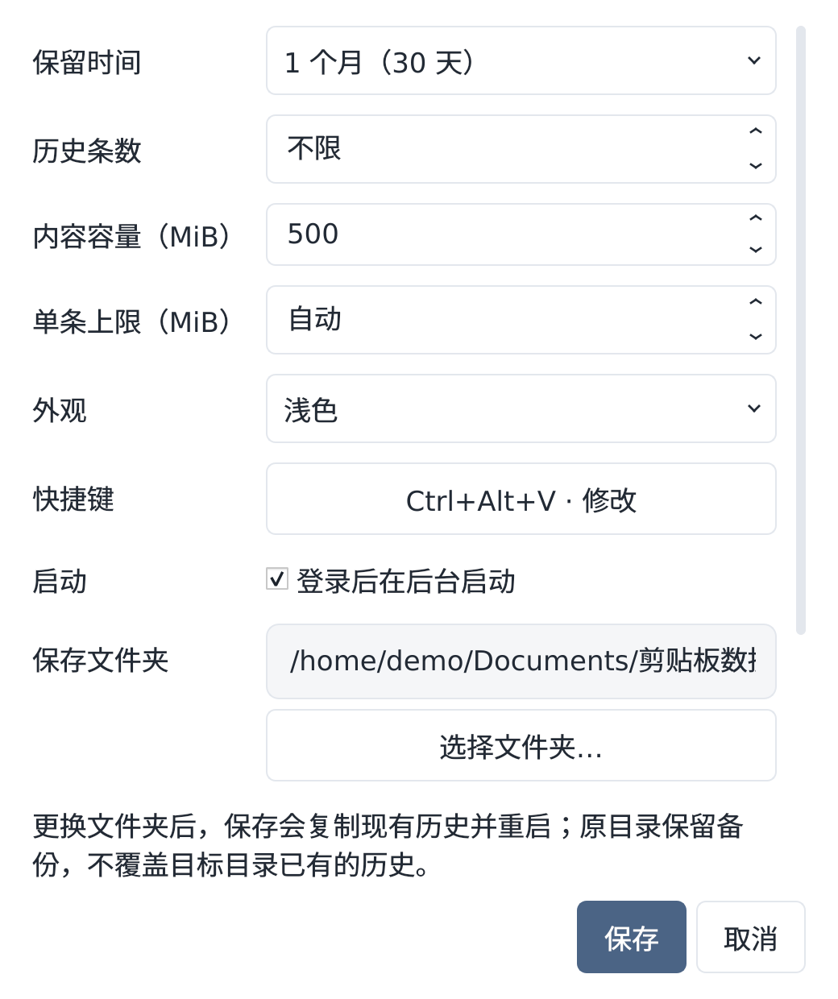

# 0.5.0 保存目录与自动粘贴修复验收

日期：2026-09-24。状态：本地隔离验证通过，三端 CI 与发行检查待完成。

## 需求与事实

用户澄清“存储空间”指历史保存文件夹，并非容量数字。原设置页的容量可输入并保存，但未提供保存文件夹选择。用户的自动粘贴问题出现在 Codex，通过 Ctrl+Alt+V 打开；截图只有失败提示，不能单凭它确定窗口权限或应用不兼容。

源码及隔离复现确认：旧版将焦点未返回、修饰键仍按下两种原因显示成同一提示；面板已经可见但在后台时，再按快捷键会直接隐藏面板，且重复打开会沿用旧目标。实际 Codex 当前活动窗口、输入焦点及捕获窗口一致，未发现该时刻的层级不匹配；这不排除间歇故障。

## 改动

- 「设置 → 保存文件夹」可选择新位置；「空间与内存」显示当前位置并提供同一入口。
- 「保存并重启」复制 SQLite 一致快照并检查完整性，保留历史、收藏、原图、HTML、设置和原目录备份；不覆盖目标现有数据库及事务文件。
- 独立配置记住目录；同步已开启的自启动路径，关闭状态不变。迁移失败回退；回退失败时保留数据并说明需检查配置。
- 管理的自启动和迁移重启要求历史存在；目录离线、历史缺失或配置损坏时拒绝静默创建空历史。Linux 长目录改用有用户标识的短 IPC 路径。
- 快捷键能从当前应用重新打开后台面板并更新目标；排除自身窗口。自动粘贴等待从约 0.75 秒改为 1.5 秒，分别说明焦点未返回或修饰键未释放。仍然核对焦点，不模拟 Enter，不向未知窗口强制注入。
- 两个设置弹窗均继承中文字体，内容滚动、底部按钮固定，换行说明按实际可用宽度安排高度。

## 验证范围

本地独立 X11 完整套件：130 项，121 通过、9 项平台相关跳过。Ubuntu deb 构建通过；界面截图使用实际 Qt 渲染和合成目录。

- 迁移正常路径、WAL 快照、精确保留记录及设置、已有数据库/事务文件、目录占用、复制与配置写入失败、自启动失败及回退失败。
- 实际 main 入口在独立子进程中完成设置保存、迁移、退出、释放锁和重启参数检查；重启失败保留数据；缺失历史不创建目录。使用假监听器和临时启动器。
- 独立 X11 验证后台面板再次通过快捷键打开，目标编辑器实际收到自造中文；延迟松开 Ctrl 后粘贴；持续按键时超时且不注入；取消旧请求不会迟发内容。
- 设置窗口覆盖中文字体、10/20pt、浅深色、窄窗口、长路径与动态错误说明；目录选择取消、保存/失败行为，以及容量键盘输入 750 MiB 后重新打开保留。
- 所有验证使用临时历史、临时目录偏好与自造数据；未读取真实历史或向 Codex 输入框自动发送内容。

## 保留限制

1. Codex 实际间歇失败尚待用户在新版复验；本次不宣称已完全复现该次故障。
2. 原目录备份继续占用磁盘，需要用户确认新目录正常后自行处理。复制时需要足够可用空间。
3. Linux/macOS 目标文件系统需要支持原子硬链接；不支持时迁移会失败并保留原历史。Windows 使用同目录重命名。
4. Windows 11 / Mac 用户实机、真实登录启动、发行签名和公证验收限制仍保留。
