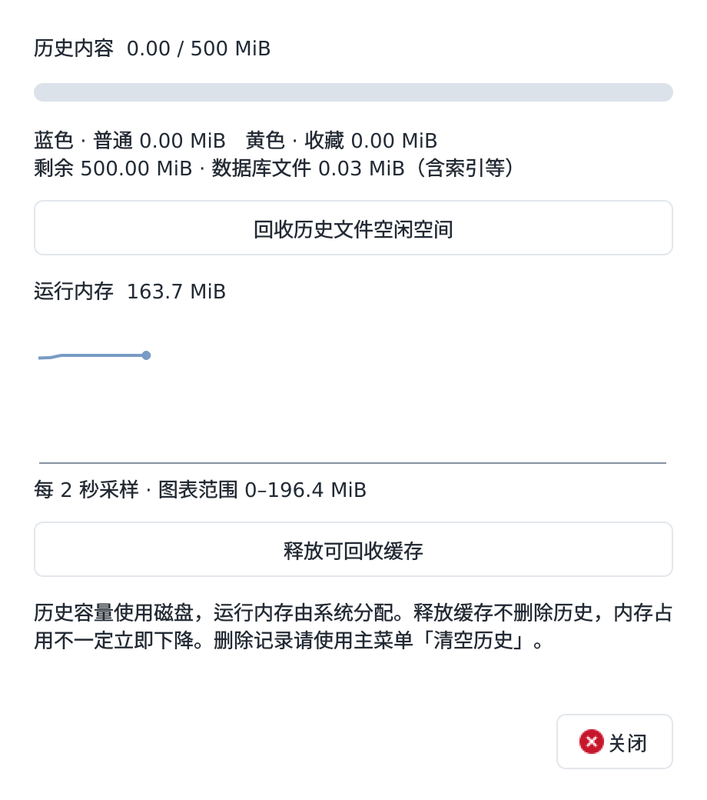

# 0.4.0 历史管理迭代

日期：2026-09-16。当前状态：本地隔离验证、三端 CI 与四种安装包检查全部通过；0.4.0 工程预览发布。

## 本轮实现

1. 按本地日期分组，保留倒序、搜索和类型筛选。
2. 默认内容预算 500 MiB（524,288,000 字节），单条自动受总容量约束；仍可设置较小单条上限。默认不再按条数清理。
3. 保留五档：1 天、7 天、30 天、365 天、无限期；默认 30 天。无限期仍受容量约束，收藏不自动淘汰。
4. 实际应用首次启动启用登录启动，可关闭；失败明确提示且下次可重试。测试、自检不会创建真实启动项。
5. 行尾空心五角星，点击收藏变黄色，再次点击取消。保留键盘收藏入口和重命名。
6. 原图按来源给出的受支持编码逐字节保存，不再统一转码或丢弃元数据。仅像素输入使用无损 PNG，缩略图单独保存。旧版已丢失的信息不能恢复。保留 2400 万像素解码保护，超限跳过，不降分辨率保存。
7. 菜单「空间与内存」提供容量条、当前进程常驻内存趋势、文件空闲空间回收与缓存释放。两项清理均不删除现有记录，不操作系统剪贴板。

## 本地验证

- 独立 Xephyr X11：85 项，76 通过，9 项平台相关跳过；原有复制、粘贴、图片、中文输入事件及布局检查均通过。
- 无界面 Qt：85 项，57 通过，28 项桌面或平台检查跳过。
- 新增：30 天和自动容量默认值；无限期仍清理超容量普通项；收藏保护；旧默认迁移及自定义规则保留；PNG/JPEG/BMP 字节一致且重启后保持；默认自启动只应用一次、失败可重试、完整子进程启动在临时配置目录写入正确启动项；跨日分组、单击收藏、双击星标不粘贴；空间整理与缓存释放不删记录和设置。
- 实际 Qt 合成界面检查：日期分组、黄色星标、五档设置、容量条和内存趋势；原有 440 宽、10/16/20 点字号、浅深主题布局测试继续通过。
- 构建 Ubuntu 0.4.0 deb 成功。未使用真实剪贴板历史进行验证。复核完整测试前后本机启动项保持一致。

## 升级与限制

数据库版本升到 3，旧版拒绝打开以避免把 JPEG 等原图误当成 PNG。保留历史、收藏及自定义规则；仅完整旧默认策略升级到新默认策略。日期取本地时区；月为 30 天、年为 365 天，非日历月/年。

内存读数为 Linux 常驻页、Windows 当前工作集、macOS RSS，不能据此跨系统比较性能。释放可回收缓存并不保证系统立即降低进程占用。默认自启动是配置写入成功，真实注销/登录仍需用户设备验收。

Windows 11 实机、macOS 基线设备、来源应用是否提供原文件、微信图片粘贴、睡眠恢复、签名与公证仍待验收。

## 合成界面预览

## 最终三端构建

[GitHub Actions 验证](https://github.com/asoming/simple-clipboard/actions/runs/35075233413)，应用及构建来源提交 `0de8e1a37fe78b3c456ceeca323fa23300a91f76`。

| 平台 | 总计 | 通过 | 跳过 |
|---|---:|---:|---:|
| linux-x11 | 85 | 76 | 9 |
| native (macos-15-intel, macos-intel) | 85 | 64 | 21 |
| native (windows-2025, windows-x64) | 85 | 63 | 22 |
| native (macos-14, macos-arm64) | 85 | 64 | 21 |

Linux deb 安装、重装与卸载检查通过；Windows 安装与升级后用户数据保留检查通过；两种 Mac 的打包启动、dmg 挂载和复制启动检查通过。以上不替代实际登录或用户常用应用验收。

[公开预览下载](https://github.com/asoming/simple-clipboard/releases/tag/v0.4.0-preview.1)。本机运行 0.4.0，启动项指向当前代码与原数据目录，未使用真实历史做测试。
