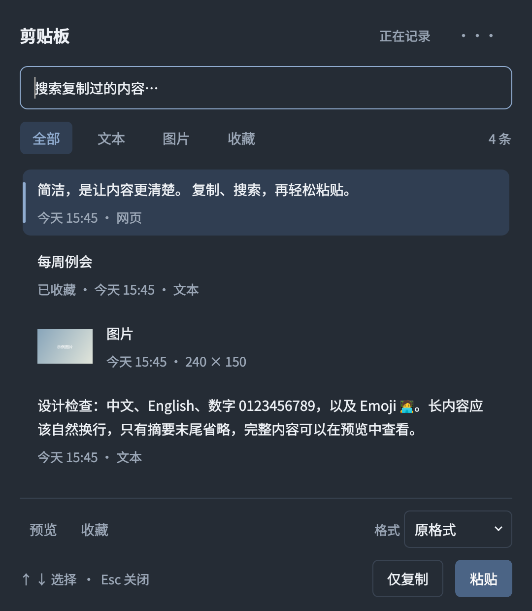

# 0.3.1 界面改版验收报告

日期：2026-09-15。用户要求“简洁但是好看”，并指出文字显示不完整。

## 修改内容

- 采用系统可用的中文字体，统一字号层级、颜色、间距；弱化次要按钮，保留明确的粘贴主操作。
- 列表根据字体和可用宽度计算行高，长摘要显示两行；Qt UTF-16 下标与 Python Unicode 下标单独处理，避免中英文、Emoji 混排时切坏字符。
- 日期、格式和收藏状态放在次要文字中；完整文本和图片仍通过「预览」查看。
- 预览、收藏与格式同排；仅复制和粘贴在底排，快捷键提示精简，完整快捷键保留在操作提示和 README。
- 格式下拉框为文字、内边距、箭头分别留位，绘制不依赖原生样式的清晰箭头。
- 真实数据和数据库格式不变，不读取用户历史进行测试或制作预览图。

## 已完成的本机检查

- 独立 Xephyr X11 桌面：77 项测试，68 项通过、9 项其他平台测试跳过。涵盖既有中文组合输入、搜索、文字/HTML/图片、复制粘贴及设置回归。
- 新增布局回归：440 像素目标宽度，10 / 16 / 20 pt 应用字体，浅色与深色，检查按钮和下拉框的中文文字区域。
- 使用合成记录检查 100% / 150% / 200% Qt 缩放；检查长中英文、Emoji、图片和收藏记录。大字号时内容列表滚动，窗口最小尺寸由控件布局约束。
- 浅色、深色和大字号截图经过实际 Qt 渲染检查；没有将效果图当作应用实现。

## 发布与限制

0.3.1 Windows、双 Mac 架构和 Ubuntu 安装包正在重新构建；构建结果及 Release 链接将在验证后补充。此前 0.3.0 的构建结果不能代表本次改动已经完成三端验证。

Windows 11、Mac 基线实机、常用应用输入法、首次权限、签名及公证等未完成项沿用 [第三阶段验收报告](第三阶段验收报告.md)。本次仍为工程预览。
