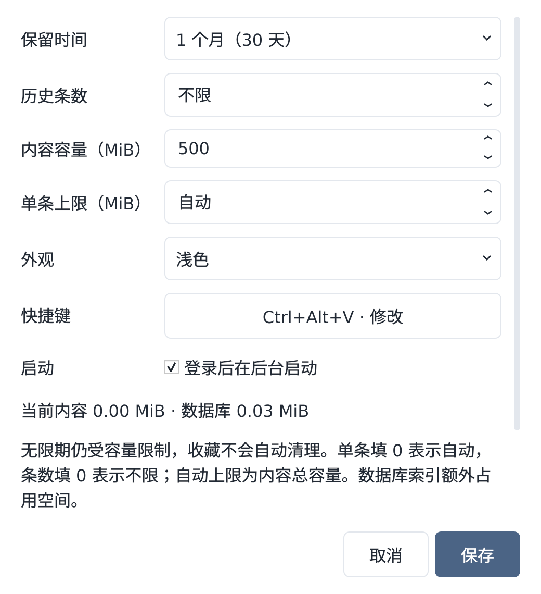

# 0.4.1 设置窗口裁切修复

日期：2026-09-16。状态：本地隔离检查、三端 CI 与四种安装包检查通过；0.4.1 工程预览交付。

## 问题与原因

用户提供的实际截图显示：保留时间、数字、快捷键按钮上下裁切，说明文字被压缩，部分内容不可读。此前主面板布局检查没有覆盖设置弹窗，合成截图也未覆盖用户实际的字体/窗口约束，不能证明设置页通过验收。

隔离复现中，主面板使用 Noto Sans CJK SC，而顶层 QDialog 没有继承父窗口显式设置的中文字体。Qt 用默认字体测得的大小无法容纳实际中文 fallback 字形：一组 Fusion 10pt 案例的中文字形高度为 22px，编辑/按钮内容区只有 10–13px。原表单和长说明处在不可滚动布局内，加重了挤压。

## 修复

- 设置对话框显式继承主面板字体。
- 根据实际中文字符包围框、最长选项宽度及样式内边距设置控件最小尺寸；包括 SpinBox 内部编辑框。
- 空间不足时表单标签换到字段上方，内容区域滚动，保存/取消按钮固定在底部。
- 下拉框与数字步进器使用统一的简洁箭头，消除原生样式与圆角边框混合产生的缺角/细横线。
- 收拢说明文字，保留容量规则和保存后的清理影响；保留所有原有设置及保存行为。
- 保存/取消移除系统装饰图标，现有历史和设置无需迁移。

## 本地检查

- 完整隔离 X11 套件：86 项，77 通过、9 项平台相关跳过。
- 新增设置页回归包含六种组合：10/14/20pt × Fusion/Windows，交错浅深色，440×400 小窗口。
- 检查全部下拉选项、数字最小/当前/最大值、中文实际字形、内部编辑区域、按钮文字；长错误说明后底栏仍在窗口内，说明末尾可滚动触达，无横向溢出。另覆盖最小允许窗口宽度与修改长快捷键后的重新布局。
- 实际 Qt 截图检查：200% 缩放常规设置页；150% 缩放、20pt 大字深色窄窗口；均使用临时历史与模拟启动配置，不接触真实剪贴板。

Windows CI 还暴露了测试窗口清理顺序的问题：仅调用 `deleteLater()` 和 `processEvents()` 会遗留窗口，更换全局样式时，旧窗口的外观回调可能访问已经关闭的测试数据库。设置页测试已在更换样式前、关闭数据库前处理 Qt 延迟销毁事件，并将 Qt 回调异常收集为明确的测试失败；文字裁切断言保持不变。

## 保留边界

高字号、小屏幕需要滚动查看全部设置，不能同时要求全部内容一屏显示与保持文字大小。此前平台签名、真实登录启动和常用应用实机验收限制不变。

## 最终三端验证

[GitHub Actions 验证](https://github.com/asoming/simple-clipboard/actions/runs/35078473083)，应用及构建来源提交 `a3bb908149c9b81378e64aedda7cf8bea3ece69d`。

| 平台 | 总计 | 通过 | 跳过 |
|---|---:|---:|---:|
| native (windows-2025, windows-x64) | 86 | 64 | 22 |
| native (macos-15-intel, macos-intel) | 86 | 65 | 21 |
| linux-x11 | 86 | 77 | 9 |
| native (macos-14, macos-arm64) | 86 | 65 | 21 |

Linux deb 安装、重装与卸载通过；Windows 安装、升级及数据保留检查通过；两种 Mac 打包启动、dmg 挂载和复制启动通过。这些检查不替代实际登录或常用应用实机验收。

[0.4.1 公开预览下载](https://github.com/asoming/simple-clipboard/releases/tag/v0.4.1-preview.1)。本机应用已正常退出旧进程并重启到 0.4.1，打开新设置窗口。保留原历史和已保存设置，未使用真实历史测试。
